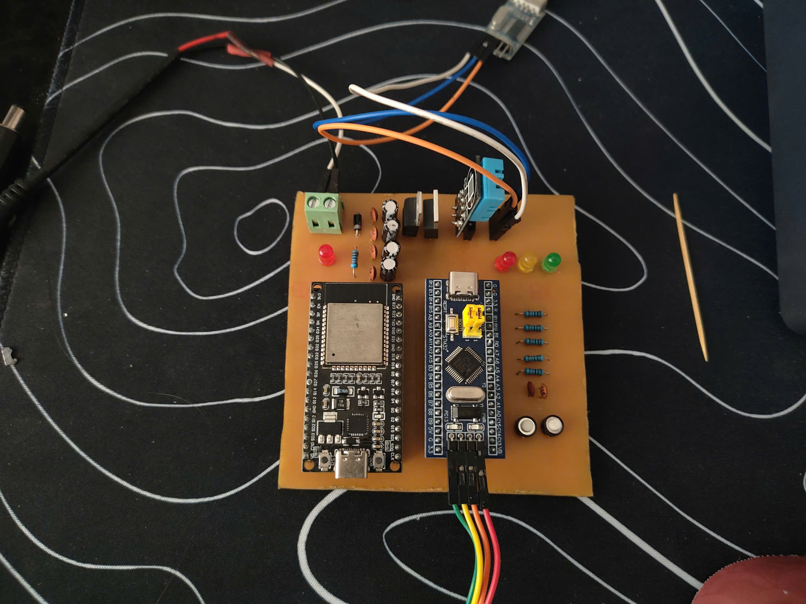
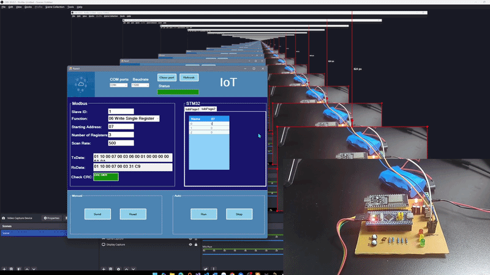

# STM32 MQTT IoT Project

Dự án board STM32F103 kết nối cảm biến DHT11, điều khiển LED, giao tiếp Modbus RTU và gửi dữ liệu lên broker MQTT (HiveMQ Cloud) bằng module ESP AT.

## Tổng quan

- MCU: STM32F103
- Cảm biến: DHT11 (nhiệt độ và độ ẩm)
- Giao tiếp MQTT qua ESP32 ở chế độ AT
- Broker mặc định: HiveMQ Cloud
- Hỗ trợ chế độ: MQTT và Modbus
- Debug / thông tin trạng thái qua UART



## Demo



## Thư mục chính

- `firmware/` - toàn bộ mã nguồn, dự án Keil MDK-ARM và thư viện dùng trong project.
  - `Core/Src/main.c` - logic chính của firmware
  - `Core/Inc/main.h` - phần khai báo chung
  - `MDK-ARM/` - project Keil, file `MQTT.uvprojx` và mã nguồn bổ sung
- `hardware/` - tài liệu mạch PCB, sơ đồ, file Altium cho board IoT
- `docs/` - thư mục hiện đang trống, có thể dùng để lưu tài liệu mở rộng

## Tính năng chính

- Đọc dữ liệu DHT11 và tổ chức payload JSON
- Kết nối và đăng ký MQTT Broker HiveMQ
- Publish JSON lên topic: `son_Tx`
- Subscribe topic: `son_Rx`
- Xử lý lệnh điều khiển từ MQTT
- Chế độ Modbus RTU slave để phản hồi/ghi thanh ghi
- Điều khiển LED trên board
- Chuyển đổi chế độ MQTT / Modbus / Debug bằng lệnh UART

## Cấu hình MQTT / Wi-Fi

Các cấu hình mặc định được định nghĩa bên trong hàm `SettingESP()` trong `firmware/Core/Src/main.c`:

- SSID Wi-Fi: `DONG SON`
- Password Wi-Fi: `05041901`
- MQTT username: `ESP32`
- MQTT password: `Son12345`
- Broker: `584e8806f87e44a8971effe122bc6789.s1.eu.hivemq.cloud`
- MQTT port: `8883`
- Publish topic: `son_Tx`
- Subscribe topic: `son_Rx`

> Nếu muốn chạy trên mạng khác hoặc broker khác, cần thay đổi các lệnh AT trong hàm `SettingESP()` và `Connect_To_HiveMQ()`.

## Build / Mở project

1. Mở Keil µVision.
2. Mở file project: `firmware/MDK-ARM/MQTT.uvprojx`
3. Build firmware.
4. Flash vào board STM32F103.

## Lý do sử dụng một số UART

- `USART1` - truyền lệnh AT tới module ESP và nhận phản hồi MQTT.
- `USART3` - dùng cho giao tiếp Modbus RTU và debug/output trên máy tính.

## Payload JSON mẫu

```json
{
  "ND":"24.50",
  "DA":"123",
  "docadc":"1.23",
  "TB1":"10",
  "TB2":"20",
  "C1":"0",
  "C2":"1"
}
```

## Ghi chú

- Dự án sử dụng thư viện `cJSON` để tạo dữ liệu JSON.
- Nếu dùng board thực tế, cần cấp nguồn ổn định và kết nối đúng các chân UART / DHT / LED.
- Thêm file `docs/` nếu muốn mở rộng tài liệu, sơ đồ đấu nối hoặc hướng dẫn vận hành.

## Liên hệ nhanh

- Nếu cần sửa cấu hình, bắt đầu từ `firmware/Core/Src/main.c`.
- Nếu cần điều chỉnh phần cứng, xem thư mục `hardware/`.
